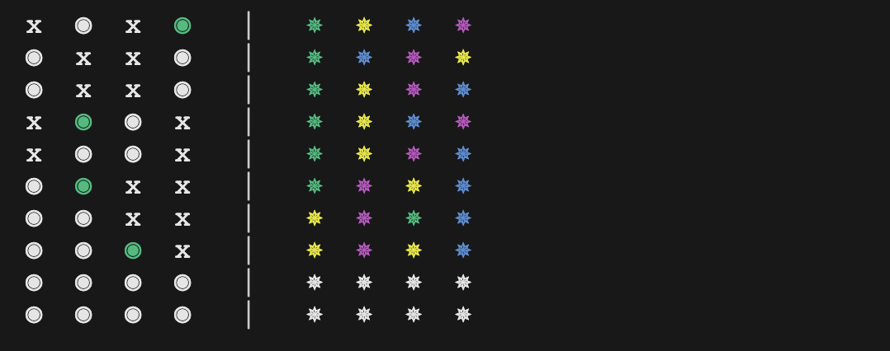

# "Mastermind"

This code-breaking game is a fascinating step forward on your programming journey, offering an opportunity to further consolidate your understanding of our foundational concepts and to encounter some fresh, intriguing challenges.

## Variables

Variables in "Mastermind" hold critical information, such as the secret code, the player's guess, the number of attempts made, and the feedback provided after each guess. By now, you should be comfortable creating and manipulating variables to drive the game mechanics.

## Conditionals

Conditionals are essential to the game's flow, used to check the player's guess against the secret code, determine if the game has been won, or if the maximum number of attempts has been reached. This application should feel familiar from your previous projects.

## Arrays

Arrays can store the secret code and the player's guesses. This might be a new use of arrays for some of you, introducing an additional layer of complexity and requiring more sophisticated array manipulation.

## Loops

Loops enable the game to continue until the player cracks the code or exhausts their attempts. The application of loops here is similar to previous projects, reinforcing your understanding of how they control program flow.

## Functions

Functions streamline the game by encapsulating tasks like generating the secret code, accepting player guesses, providing feedback, and checking win conditions. This project encourages you to create even more versatile and reusable functions.

"Mastermind" builds upon what you've learned from the previous projects, particularly the importance of separating game state from visual representation. Just like in "Tic Tac Toe", your game logic should be distinct from your interface, whether it's a console or a graphical UI. This practice will make your code more maintainable, reusable, and versatile.

Now, what's new in "Mastermind"? You'll deal with more complex logic in this game, especially when providing feedback on a player's guess. This isn't just about whether the guess is correct or not—it's about indicating which elements of the guess are correct, which are in the wrong position, and which aren't in the code at all.

Mastermind is an engaging step up in complexity from your previous projects. It's an excellent opportunity to apply your knowledge, learn new techniques, and solve problems in a context that's different from the games you've worked on so far. Prepare to crack the code of "Mastermind"!

## TIPs

- Using and creating functions is a good idea for this assignment.
- You do not need to do everything to have the assignment approved

## Project Requirements

You must use the code from [https://github.com/CodeCraftCurriculum-I/module_6_mastermind](https://github.com/CodeCraftCurriculum-I/module_6_mastermind)

- Create a different animation for the splash screen, this includes creating a new "graphics" etc.
- Fix it so that the menu is always below the "logo".
- The rules of mastermind state that the players should:
  - (A) Agree on the number of attempts (but max 10)
  - (B) Agree if it is allowed with duplicates.
- Add the code for the game to have these options (A and B). (Duplicates are the use of the same colour more than once.)
- Currently, the player can input a sequence shorter or longer than needed. Only permit inputs that are the correct length.
- The current output is not pretty and uses numbers instead of colours. Change the code, so the board looks like the following image (as close as possible). The evaluation is on the left, and the guesses are on the right. Note that we are showing the whole board, including the attempts that have not been used yet (all white colours). The code already contains code that shows how to use colours.
    
- Add a Legend after the game board. A legend explains characters, symbols, or markings that may be unfamiliar to the reader.
- Find some way to have the player select colours, not just type numbers (at the moment, the players do not know what the numbers symbolize in colors).
- Add a summary after the game, including information about whether the player won or lost, how well they did, etc. Then return to the menu.

### Challenge Requirements (Higher Grades)

- Let the player decide the number of elements in the hidden sequence (Currently it is 4)
- Let the player decide the number of colors that can be used for the sequence.
- ... Come up with something interesting.

In your `readme.md` file write some reflections about your code.

**Your submission must be in the form of a Zip file with a sensible internal structure.**

## About assessment

Assessment for this project will be based not just on feature completion, but also on your attention to detail, the cleanliness and readability of your code, and the thoughtfulness of your README file reflections. This is your opportunity to demonstrate not just what you've learned, but how you can apply it creatively and effectively in a real programming project.

---
